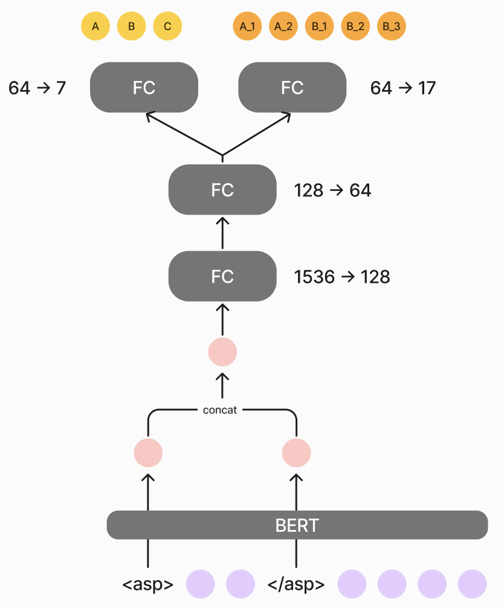

# Multitask-Classification

This project aims to classify aspects from given text data into different subcategories, using a multitask learning approach. It is specifically designed for aspect-based sentiment analysis tasks, where each aspect in the text is associated with an polarity and a specific subcategory.
## Model Architecture


### Key Features
* Pretrained Backbone: The model is based on a pretrained transformer architecture for contextualized text representation.
* Multi-Head Outputs: Separate classification heads for predicting categories (auxiliary task) and subcategories (main task).
* Shared Encoder: A shared encoder layer ensures efficient representation learning for all tasks.

## Training Data
The training data consists of labeled sentences with detailed annotations for each aspect. Each entry includes the following fields:

* text: The review or comment text.
* rating: An overall rating (e.g., from 1 to 5).
* brand: The brand or entity being reviewed.
* labels: A list of annotations where each label contains:
>* aspect: The specific aspect being mentioned.
>* polarity: The sentiment polarity (e.g. positive, negative, or neutral).
>* category: The general category of the aspect.
>* subcategory: A more specific classification of the aspect.

### Example Training Data Entry:
```json
{"text": "非常棒的飯店，位置很好，旁邊就是百貨公司信義商圈。房間有view。可以看到101。很有質感的飯店", "rating": 5, "brand": "艾麗", "labels": [{"aspect": "飯店", "polarity": "positive", "category": "其他", "subcategory": "整體"}, {"aspect": "位置", "polarity": "positive", "category": "周遭環境、交通", "subcategory": "其他"}, {"aspect": "房間", "polarity": "positive", "category": "房間、客房服務", "subcategory": "景觀"}]}

